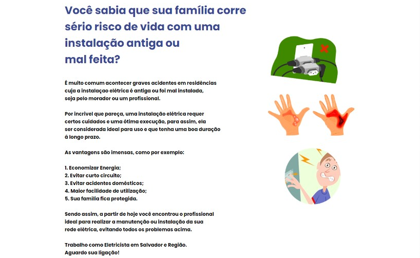
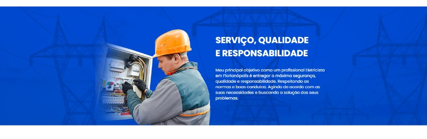
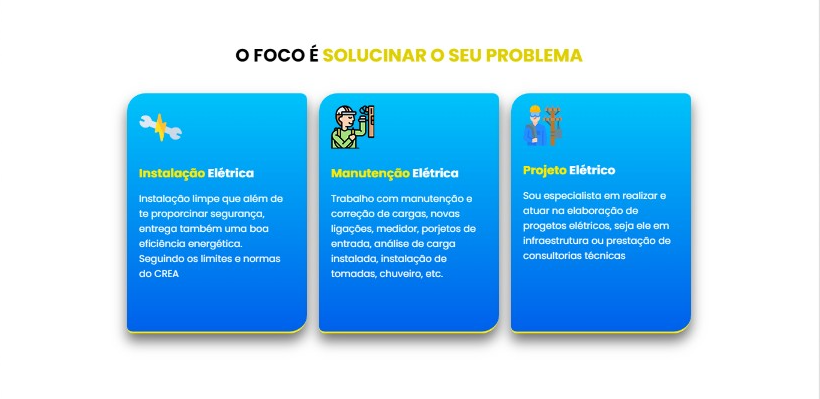
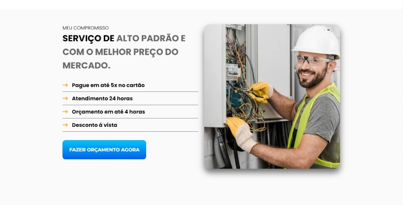
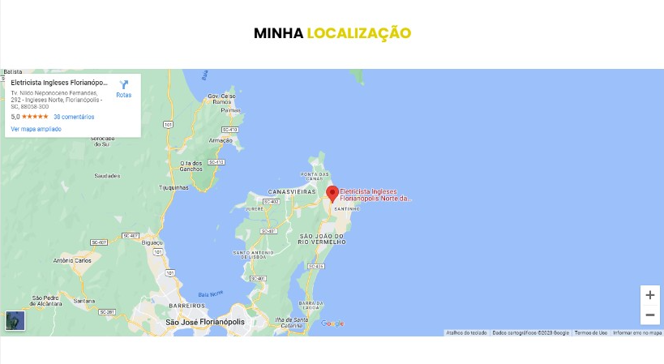
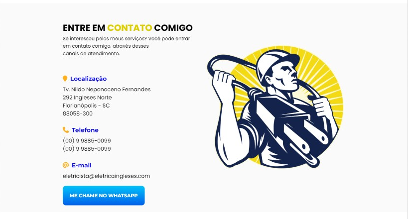
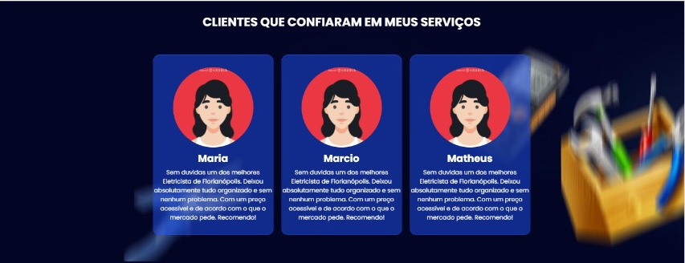
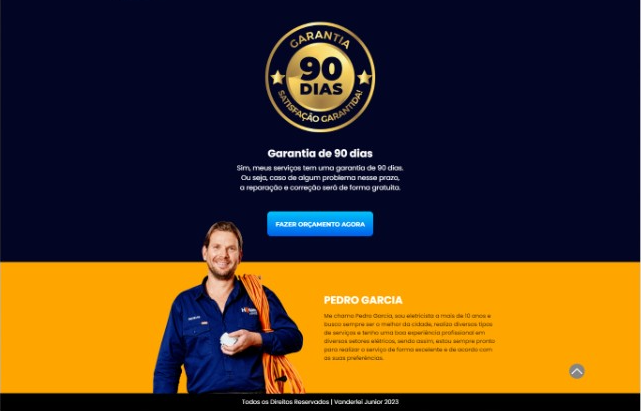
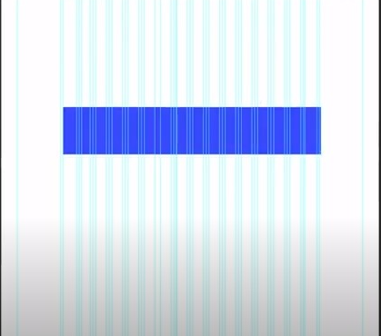

# Landing page para Eletricista

##  📋 Índice

- <a href="#sobre-o-projeto">Sobre o Projeto</a>
- <a href="#objetivos">Objetivos</a>
- <a href="#funcionalidades">Funcionalidades</a>
- <a href="#captura-de-tela">Capitura de Tela</a>
- <a href="#linguagens-utilizadas">Linguagens utilizadas</a>
- <a href="#o-que-eu-aprendi">O que eu aprendi</a>
- <a href="#recursos-úteis">Recursos úteis</a>
- <a href="#autor">Autor</a>

##  Sobre o Projeto

Uma Langin Page para divulgação de Serviço prestado. Fornece ao usuário uma rápida consulta sobre o profissional e suas habilidades no ramo procurado, nesse caso de um Eletricista local que pode assim apresentar seu trabalho para todos com mais facilidade e rapidez, com essa página na internet o profissional pode apresentar ao cliente seus trabalhos anteriores, suas especialidades, como o cliente pode entrar em contato ou encontralo através do mapa, ter um site hoje em dia é muito importante para se posicionar em meio a concorrencia e uma Landing Page atende muito bem a maioria dos profissionais autônomos em nosso País.

##  Objetivos

- Ganhar mais experiência em HTML e CSS.
- Trabalhar e estilizar Listas.
- Fazer um Layout Padronizado.
- Criar um Layout Responsivo.

## Funcionalidades

- [x] Usar uma imagem de fundo no topo da página.
- [x] Colocar imagens e textos um ao lado do outro.
- [x] Criar listas estilizadas.
- [x] Integrar mapa ao projeto.

### Captura de tela 
📸

Topo Da Página

Seção Perigos

Seção Seviço

Seção Foco

Seção Compromisso

Seção Localização

Seção Contato

Seção Depoimentos

Seções Garantia, Sebro e Footer

## Linguagens utilizadas
📝
HTML | CSS

###  O que eu aprendi
🤓

- Criar Layout Responsivo e padronizado construído em cima do Grid. A função do Grid basicamente é organizar a informação em uma página.

- O Reset CSS limpa TODOS os padrões dos navegadores. É uma forma muito agressiva de "limpeza", enquanto o Normalize ainda mantém padrões que são úteis. Normalize CSS corrige alguns bugs que existem nas estilizações padrões dos navegadores.

- Estilizei a lista na seção Foco de uma forma que parece que são card oque ao meu ver foi muito legal.

###   Recursos úteis
🔧

- colocar efeito de vidro no card, no meu caso usei no li <a href="https://css.glass/">Clique aqui!</a>
- Font Awesome <a href="https://kit.fontawesome.com/a31cf5ebe6.js">Clique aqui!</a>
- Google Fontes <a href="https://fonts.google.com/">Clique aqui!</a>

##   Autor
🧑‍💻

### Vanderlei Junior
- <a href="https://github.com/VanderleiGeronimoJunior">GitHub</a>
- <a href="https://www.linkedin.com/in/vanderlei-junior-b9956686/">Linkedin</a>

